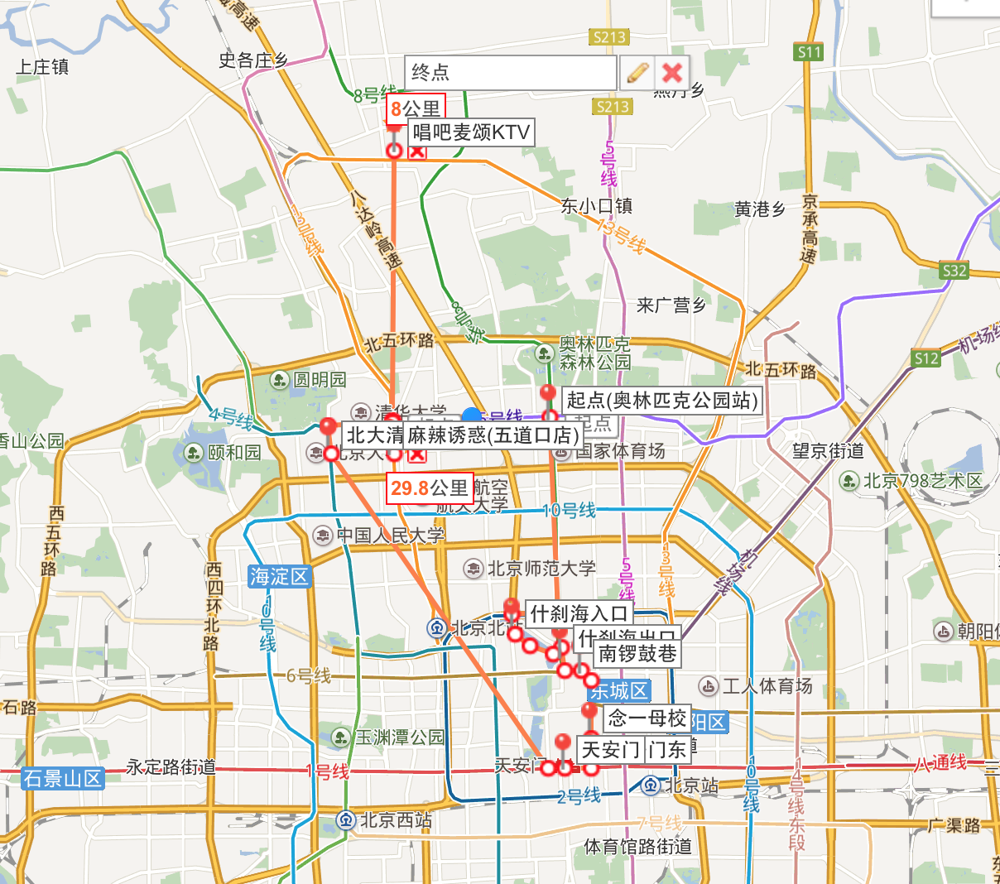

# 骑行

## 路线由**`王念一`**小朋友倾情奉献

### 集合

* 地点：西单文化广场

* 时间：9:00 上午

* 目标：环后海骑行观光

* 时间：~2h

#### 路线

* 沿西四向北至新街口南大街

* 过西直门内大街后向东拐至新街口东街

* 直行至德胜门内大街

* 沿路东向北骑行一小段

* 向西沿什刹海南滨河路骑行并入后海南沿

* 过银锭桥后继续向东南骑行一小段

* 向东拐入万年胡同

* 出胡同口向北进入地安门外大街东侧车道

* 行至鼓楼向东进入鼓楼东大街

* 由小菊花（儿）胡同向南进入南锣鼓巷

### 午餐

* 地点：南锣鼓巷

* 内容：待定

* 时间：~1h 下午

* 目标：故宫

* 时间：~3h

#### 路线

* 出南锣鼓巷南口

* 沿路南向东行至东皇城根大街右转进入

* 南行至东华门大街

* 向南进入南池子大街

* 进入长安街

* 抵达目的地

### 晚餐

* 目标：五道口麻辣诱惑/回龙观盛百味

#### 路线

* 地铁天安门东/西站上车，向东乘至西单

* 由西单换乘4号线，向北乘至西直门

* 由西直门换乘13号线，向北乘至五道口/回龙观

* 商家信息

	- 地点：海淀区成府路28号五道口购物中心A座6层
	
	- 电话: (010)60786078, (010)60779789

### 晚上

* 目标：唱K

	- **唱吧麦颂**
	
	- 电话：(010)51077383
	
	- 地址：北京市昌平区回龙观镇育知东路30号院5号楼华联商厦F2

	- **火烈鸟量贩式KTV**

	- 电话：(010)60706988

	- 地址：回龙观西大街19号北店时代广场E段B1层

#### 路线

* 地铁五道口站上车，向北乘至回龙观

# 聚餐 - **由`李红`同学倾情推荐**

---

* [麻辣诱惑(五道口店)](http://j.map.baidu.com/XQn1o)

商户电话: **010-62666788**

商户电话: **海淀区成府路28号五道口购物中心A座6层**

---

* [盛百味(回龙馆店)](http://j.map.baidu.com/nn7Ik)

商户电话: **(010)60786078, (010)60779789**

商户地址: 
**回龙观东大街5号楼105号1至3层**

---

* [沸腾鱼乡(知春路店)](http://j.map.baidu.com/LDU7k)

商户电话: 
**(010)82311286**

商户地址: **知春路17号(近大运村南门)**

---

* [便宜坊(五彩城店)](http://j.map.baidu.com/aTPkr)

商户电话: **010-82816889**

商户地址: **北京市海淀区清河中街68号华润五彩城4层**

---

 
 
# 唱K - **由`李栋栋`同学倾情推荐**

---

- [唱吧麦颂(回龙观店)](http://j.map.baidu.com/jBXMF) 

商户电话: **(010)51077383**

商户地址: **北京市昌平区回龙观镇育知东路30号院5号楼华联商厦F2**

---

- [火烈鸟量贩式KTV(回龙观店)](http://j.map.baidu.com/pSOkB)

商户电话: **(010)60706988**

商户地址: **回龙观西大街19号北店时代广场E段B1层**

<!--# 逛大街
# 视像
-->

---

 

# To Eat List

# 计划但未使用路线

**路线图概览**

路线说明:

起点: 奥林匹克公园站集合(时间待定)

- 第一站: 国家体育馆周边

- 第二站: 什刹海、后海周边

- 第三站: 南锣鼓巷

- 第四站: 天安门(是否进入需提前购票)

- 第五站: 北大清华(时间赶就坐地铁)

- 第六站: 五道口麻辣诱惑/回龙观盛百味（13号地铁）

终点站: 唱吧麦颂KTV

 

**PC端点击查看地图详情**

**<http://j.map.baidu.com/iQUGe>**

 

