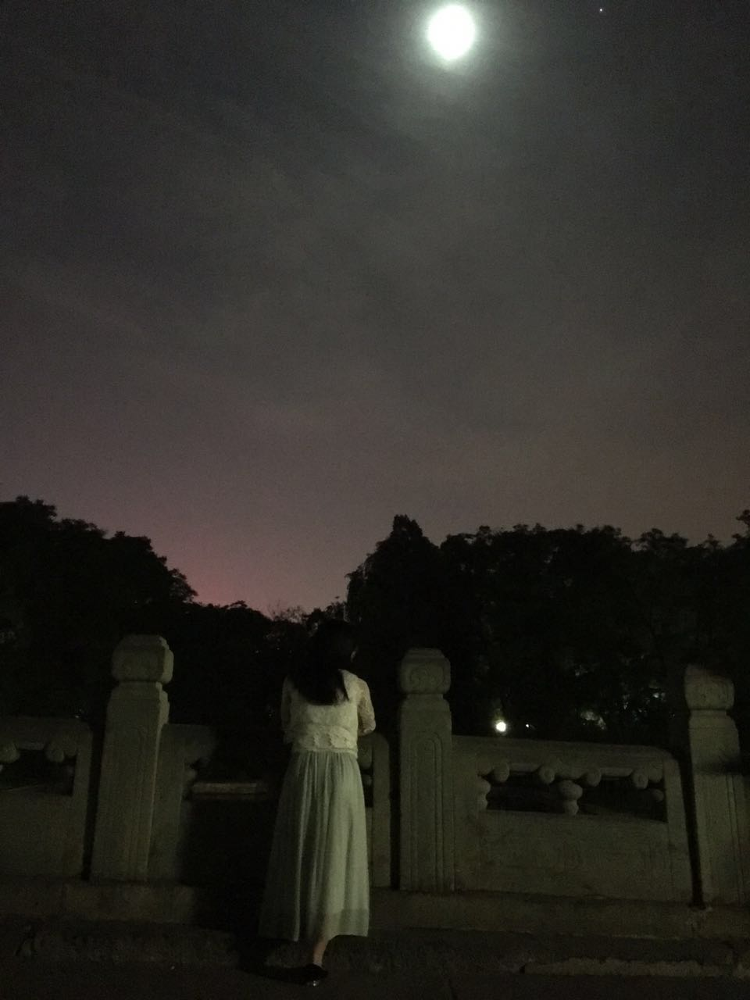
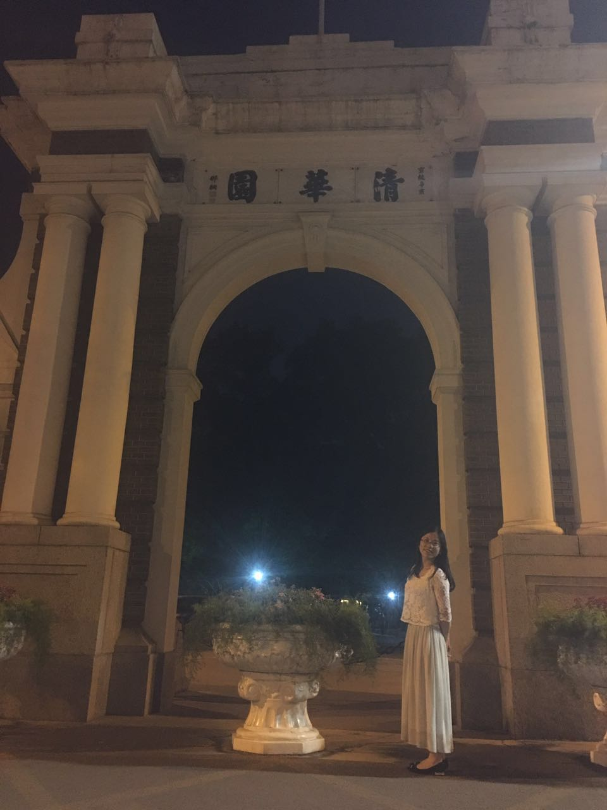
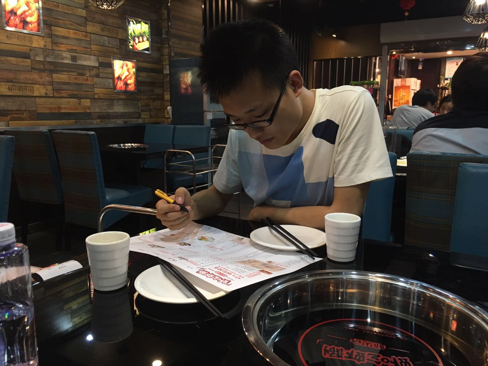
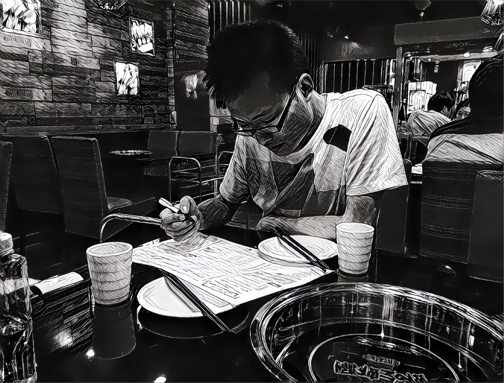
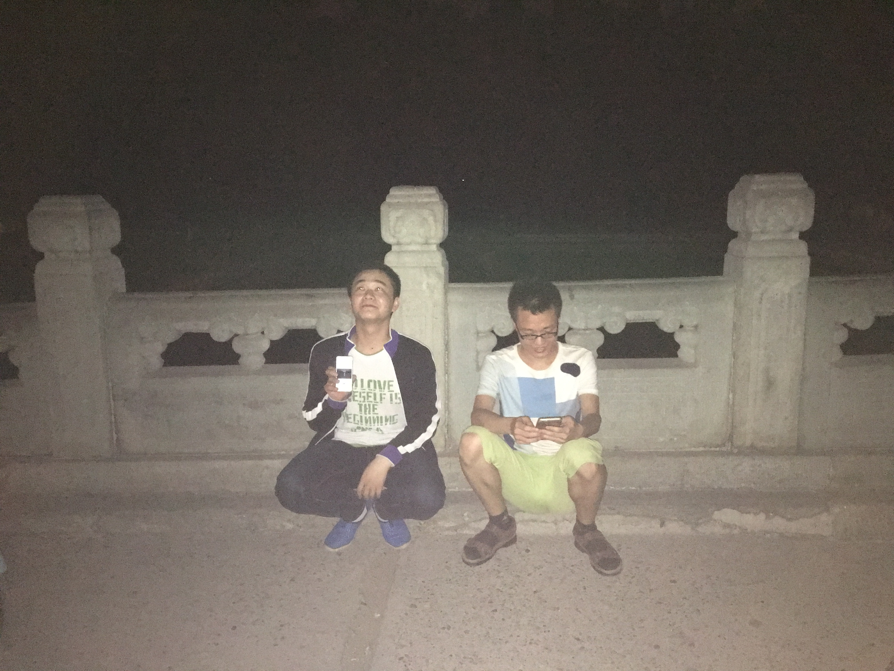
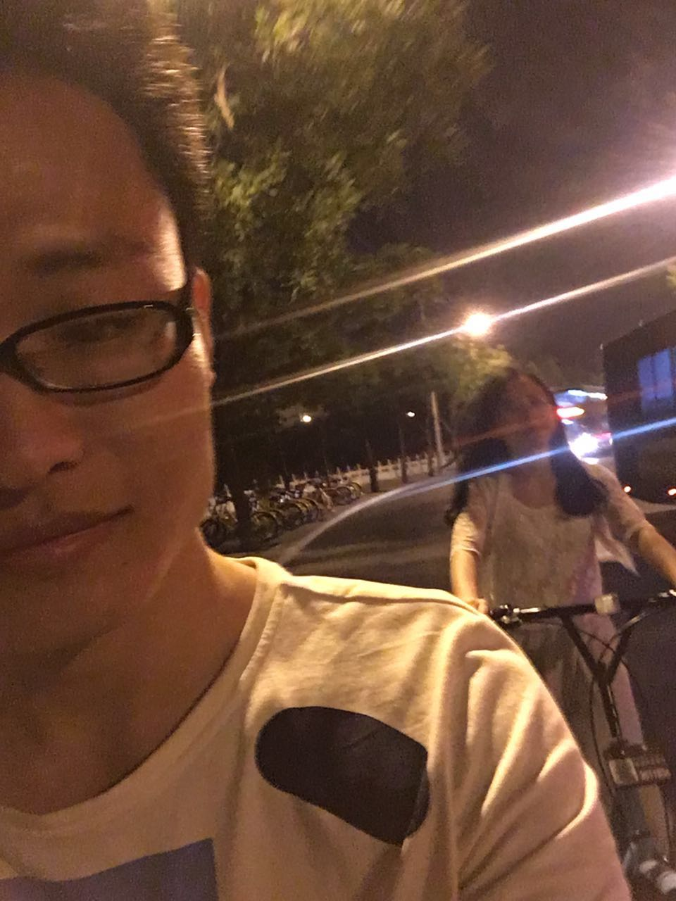
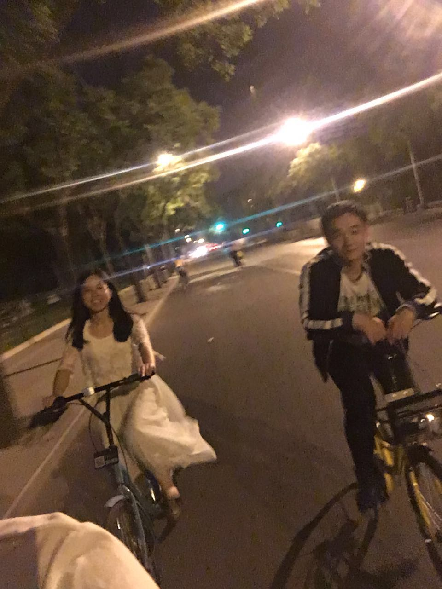
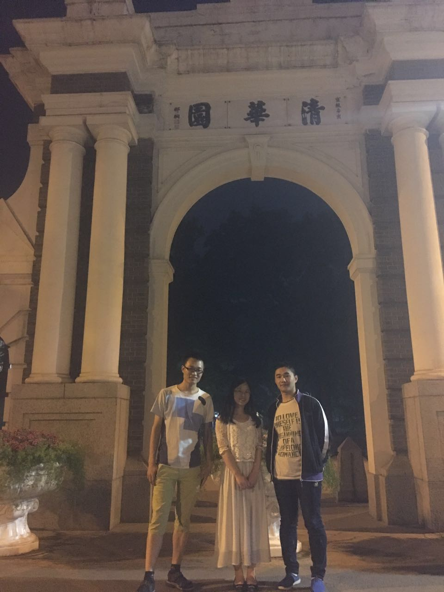
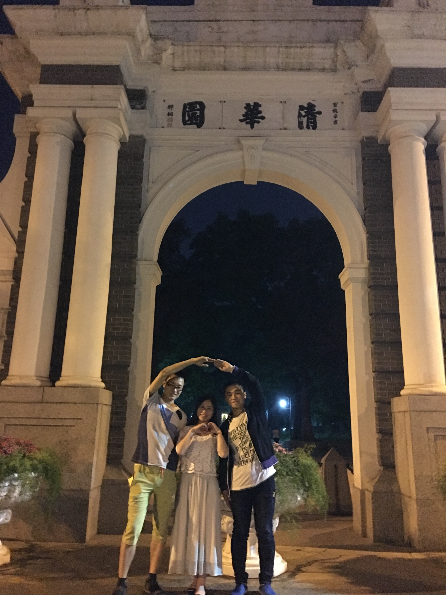
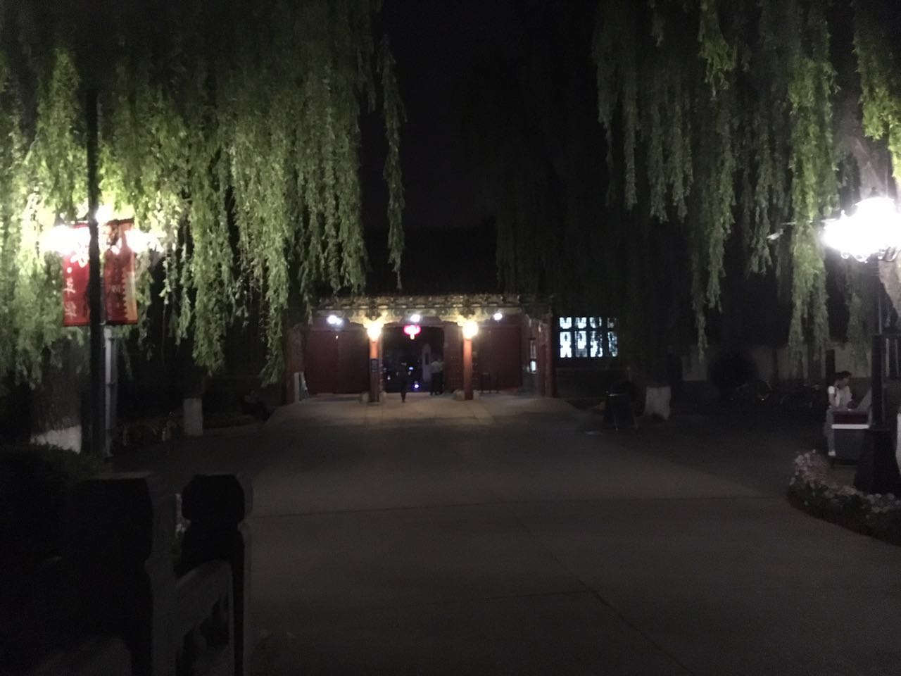

# 女神张

<b>月光下的女神</b>

 

<b>回眸一笑的女神</b>

 

# 帅哥李

<b>专注点菜的帅哥李</b>

 

<b>素描风格的帅哥李</b>

 

# 合照

<b>傻逼龙和帅哥李</b>

 

<b>销魂的帅哥李和女神张</b>

 

<b>肥龙与女神</b>

 

<b>装逼的三巨头</b>

 

<b>节操好像掉了</b>

 

<b>北大西门的垂柳</b>

 

**后记:** 双清路至上地十街，骑行八公里。是夜(20170508)零点半回到家中。

